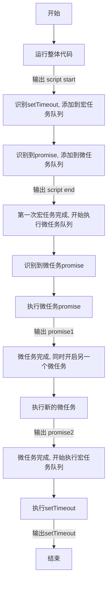
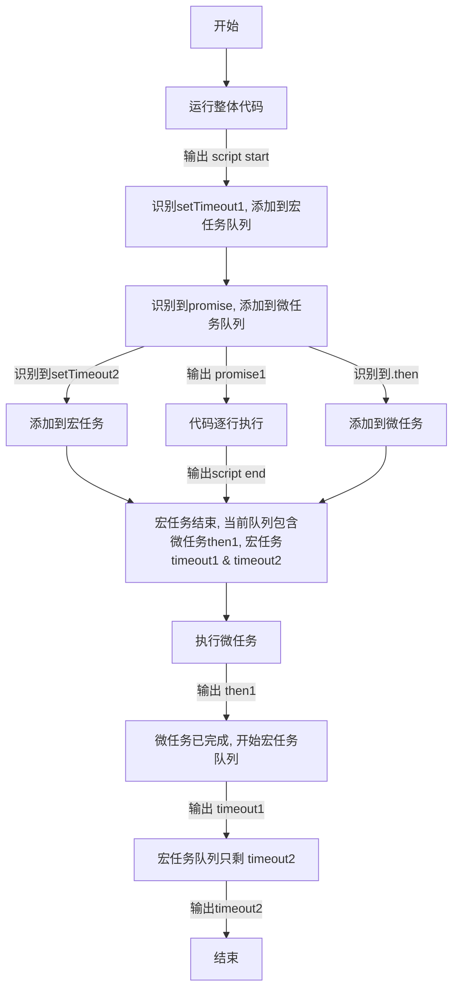

# promise 详解

最近想重新换工作，几乎所有面试都会问到 promise，有简单理解的，也有问到一些比较复杂的实现，有些我是知道的但也有些是不清楚的，所以查阅资料，把关于 promise 的知识补充提升一下。

::: tip
  本文使用用户登录情况进行模拟
:::

## promise 的出现解决了什么样的问题

### 回调地狱

在 promise 出现之前，js处理异步逻辑的方式只有通过回调函数，及<HighlightText msg="某个方法执行结果返回之后，才去调用的函数。" />以此来确保回调的方法执行在登录结果返回之后。

```js
  // 获取公钥
  ajax('get-public-token', function (token) {
    // code ...
    // 生成私钥
    ajax('gen-private-key', token, function (key) {
      const form = {}
      form.key = key
      // other code ...
      // 执行登录
      ajax('login', form, function (userInfo) {
        // 如果需要用登录信息继续执行某些操作，还得在这里继续写下去
      })
    })
  })
```

这只是简化的登录流程，实际的登录可能会更加复杂，当然也会存在比登录更复杂的业务逻辑，使我们不得不一层一层添加逻辑。导致最后很难读懂，维护难度指数型增加。

## promise 语法

### 基本语法 && 成功处理

```js
  new Promise((resolve, reject)=> {
    resolve('success')
    reject('error')
  })
  .then(
    res=> { console.log('success', res) }
    err=> { console.log('error', err) }
  )
  .catch(err=> { console.log(err) })
```

- promise 有三个状态
  - pending 等待结果返回（未完成）
  - fulfilled 实现（操作完成）
  - rejected 被拒绝（操作失败）
  - 状态一旦改变，不会再次改变
- 因此 promise 状态状态改变只有两种可能
  - pending => fulfilled，操作由未完成变为成功，这时会触发`resolve`，<HighlightText msg="将操作的结果作为参数传递出去" />
  - pending => rejected， 操作由未完成变为成功，这时会触发`reject`，<HighlightText msg="将操作结果的错误信息作为参数传递出去" />

<HighlightText msg="必须注意的是，promise.then()必须返回一个新的promise对象，才可以继续对其调用.then" />

```js
  new Promise(resolve=> {
    // 获取公钥
    ajax('get-public-token', success(token) {
      resolve(token)
    })
  })
  .then(res=> {
    return new Promise(resolve=> {
      // 生成私钥
      ajax('gen-private-key', success(key) {
        resolve(key)
      })
    })
  })
  .then(key=> {
    console.log(key) // 私钥信息
    // other code ...
  })
```

### 错误处理

promise 会自动捕捉异常，交给 rejected 函数处理

```js
  new Promise(resolve=> {
    setTimeout(()=> {
      throw new Error('error!')
    })
  })
  .then(res=> {
    console.log(res)
  })
  .catch(err=> {
    console.log(err) // error!
  })
```

这里需要注意的是链式执行异步操作时，你可以选择为每一步操作做错误处理，类似`a().then(b()).catch().then(c()).catch()`，也可以将错误处理放在最后执行，类似`a().then(b()).then(c()).catch()`。但一般推荐第二种方式，更加方便阅读。

还有一点需要注意的是 catch 本身也会返回 promise 实例，并且状态是 resolve，而且一旦执行到 catch 中，链式操作将会中断，不再继续执行。

```js
  new Promise(resolve=> {
    setTimeout(()=> {
      resolve()
    }, 1000)
  })
  .then(()=> {
    console.log('promise1')
    throw new Error('error')
  })
  .then(()=> {
    console.log('promise2')
  })
  .then(()=> {
    console.log('promise3')
  })
  .catch(err=> {
    console.log(err)
  })
  // promise1
  // Error: error
  // 不会继续执行 promise2 和 promise3
```

### promise.all()

这个方法会在所有异步操作执行完成并且状态全部为成功的时候执行回调方法

```js
  function randomA() {
    return new Promise((resolve,reject)=> {
      setTimeout(()=> {
        const num = Math.floor(Math.random() * 10)
        console.log('num: ', num);
        if (num <= 5) {
          resolve(num)
        } else {
          reject('randomA:数字大于5是不行的')
        }
      }, 1000)
    })
  }

  function randomB() {
    return new Promise((resolve,reject)=> {
      setTimeout(()=> {
        const num = Math.floor(Math.random() * 10)
        console.log('num: ', num);
        if (num <= 5) {
          resolve(num)
        } else {
          reject('randomB:数字大于5是不行的')
        }
      }, 1000)
    })
  }

  function randomC() {
    return new Promise((resolve,reject)=> {
      setTimeout(()=> {
        const num = Math.floor(Math.random() * 10)
        console.log('num: ', num);
        if (num <= 5) {
          resolve(num)
        } else {
          reject('randomC:数字大于5是不行的')
        }
      }, 1000)
    })
  }

  Promise.all([randomA(), randomB(), randomC()]).then(res=> {
    console.log(res)
    // success: [1,2,3]
    // error: Uncaught (in promise) randomB:数字大于5是不行的
  })
```

可以复制上面代码运行，只有当三个方法值全部小于 5，才会返回正确的值。可以看到正确返回时，返回值是数组的形式。数组中每一项对应 all 方法中的每一个异步操作的结果。

### promise.race()

这个方法完全区别于`promise.all()`，上面的方法在所有异步操作完成之后才执行，这个方法则是<HighlightText msg="谁先完成就先处理谁。" />需要注意的是，其余的操作还会继续执行，只是不会进入 race 的回调方法。

```js
  // promise.all 的例子，将 timeout 区分开来
  function randomA() {
    return new Promise((resolve,reject)=> {
      setTimeout(()=> {
        const num = Math.floor(Math.random() * 10)
        console.log('num: ', num);
        if (num <= 5) {
          resolve(num)
        } else {
          reject('randomA:数字大于5是不行的')
        }
      }, 1000)
    })
  }

  function randomB() {
    return new Promise((resolve,reject)=> {
      setTimeout(()=> {
        const num = Math.floor(Math.random() * 10)
        console.log('num: ', num);
        if (num <= 5) {
          resolve(num)
        } else {
          reject('randomB:数字大于5是不行的')
        }
      }, 2000)
    })
  }

  function randomC() {
    return new Promise((resolve,reject)=> {
      setTimeout(()=> {
        const num = Math.floor(Math.random() * 10)
        console.log('num: ', num);
        if (num <= 5) {
          resolve(num)
        } else {
          reject('randomC:数字大于5是不行的')
        }
      }, 3000)
    })
  }

  Promise.race([randomA(), randomB(), randomC()]).then(
    res=> {
      console.log('res: ', res)
    },
    err=> {
      console.log('err: ', err)
    }
  )
```

#### 利用promise.race实现需求 - 如果接口 10s 内返回数据就处理数据，否则执行其他操作

```js
  function getData() {
    return new Promise(resolve=> {
      ajax('url', success(res) {
        resolve()
      })
    })
  }

  function timeout() {
    return new Promise((resolve, reject)=> {
      setTimeout(()=> {
        reject('请求超时')
      }, 10000)
    })
  }

  Promise.race([getData(), timeout()])
  .then(res=> {
    console.log(res)
  })
  .catch(err=> {
    console.log(err)
  })
```

## 微任务 & 宏任务

这也是面试经常出现的考点，也是我最不愿意回答的问题之一，因为明明知道是什么但总表达不清楚，垃圾的面试题洋洋洒洒十几行又一不小心就会做错，导致这个面试题一直无法准确反映出个人真实能力。接下来用我自己的方式解释这个问题。

首先，js是单线程语言，对代码的解析<HighlightText msg="是逐行进行的，前一行没有执行完成时，必然不会同时执行另一行代码。" />但是异步方法可以绕过执行顺序，当发起异步方法时，<HighlightText msg="不阻塞代码解析，等返回结果之后才去处理异步方法的结果。" />

有点绕口，不过没关系。可以想象一下去银行办业务的流程。每个业务窗口前都排起了长队，业务员只能同时为一个人做服务。从接待第一个客户开始，业务员<HighlightText msg="开始为客户办理业务，" />如果该客户只办理一个业务，办理完成，客户离开，开始为下一个客户服务，循环往复，<HighlightText msg="视为一个大的循环。" />而如果客户办理完某一个业务，又对其他业务产生兴趣，开始询问或者办理其他业务，这个过程中当前大循环没有结束，但<HighlightText msg="办理每项业务的过程可以视作一次小的循环。" />并且在小循环没有结束前，业务员都会为当前客户服务，后面的客户还是只能排队，<HighlightText msg="等待前一个客户的大循环完成。" />

参考以上例子，结合循环的概念，类比如下：

- 每个客户开始办理业务，到业务办理结束离开的这一个大循环，可以理解为js中的一段<HighlightText msg="宏任务" />。
- 单个客户办理的每一项业务，可以视作一个<HighlightText msg="微任务" />
- 当前客户有可能原本只想办理一项业务，但临时起意又追加了其他业务，在这个过程中，微任务还在继续，后面的其他客户也只能等前一位客户完成，才可以开启他的宏任务。因此可以理解为<HighlightText msg="当前微任务未完成时，不会开启下一个宏任务" />
- 整个任务队列的执行过程为：
  - 首先开启一个宏任务（从接待第一位客户开始）。
  - 执行过程中如果产生新的微任务，将他们推入相应的任务队列，之后执行微任务（客户临时追加业务）。
  - 之后再执行宏任务（开始接待第二个客户）
  - 如此不断循环

类似的，JS任务队列的执行过程就是：

- 先执行一个宏任务
- 执行过程中如果产出新的任务，就将他们推入相应的任务队列
- 之后在执行一队微任务
- 之后再执行宏任务
- 不断循环

以上整个循环过程，就叫做<HighlightText msg="事件循环(Event Loop)。" />

而具体到JS中，主要的宏任务包括：代码行的逐行解析过程、setTimeout、setInterval、I/O；主要的微任务包括 Promise、process.nextTick(Node.js)

### 通过示例理解执行过程

```js
console.log("script start");

setTimeout(function () {
  console.log("setTimeout");
}, 0);

Promise.resolve()
  .then(function () {
    console.log("promise1");
  })
  .then(function () {
    console.log("promise2");
  });

console.log("script end");
```

根据上面的执行流程，步骤如下：



-----
<HighlightText msg="需要注意的是：只有 .then中的代码才是异步执行的， new Promise()中的代码是同步代码。" />

```js
console.log("script start");

setTimeout(function () {
  console.log("timeout1");
}, 10);

new Promise((resolve) => {
  console.log("promise1");
  resolve();
  setTimeout(() => console.log("timeout2"), 10);
}).then(function () {
  console.log("then1");
});

console.log("script end");
```

执行步骤如下：



就是这样

最后，上面提到过的一点要始终牢记：<HighlightText msg="当前微任务未完成时，不会开启下一个宏任务，需要等当前微任务队列执行完成。" />因此：

```js
const s = new Date().getSeconds();
console.log("script start");
new Promise((resolve) => {
  console.log("promise");
  resolve();
}).then(() => {
  console.log("then");
  while (true) {
    if (new Date().getSeconds() - s >= 4) {
      console.log("while");
      break;
    }
  }
});
// 该宏任务要等到微任务完成才会真正执行
setTimeout(() => {
  console.log("timeout");
}, 2000);
console.log("script end");
```

代码和上一个例子相似，就不具体阐述了，需要注意的只有微任务中添加了一段逻辑导致该微任务队列会在延时4秒后才能执行完成。因此后面的宏任务也被推迟了4s才真正执行。因此输出的结果为：`script start`、`promise`、`script end`、`then`，四秒后显示`while`、`timeout`。并且`while`输出在`timeout`之前，因为`while`是作为微任务，是先执行的。

文章的最后还是忍不住想吐槽某些公司招聘中关于微任务和宏任务的面试题，有的甚至题面为我上述示例的3/4倍。我还是想说，面试的目的旨在考核面试人员对知识的掌握程度，真没必要故意刁难。
